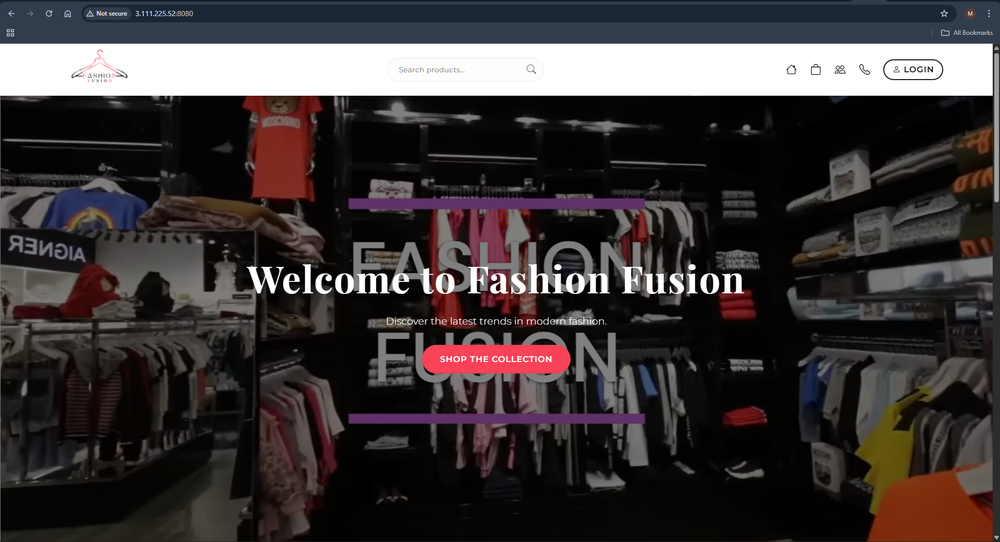
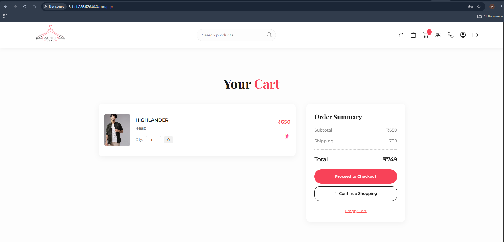

# 🛍️ Fashion Fusion

### Modern E-Commerce Clothing Store

---

## 📝 Overview

Fashion Fusion is a modern, responsive e-commerce platform built using PHP and MySQL. It provides a seamless shopping experience with features like product browsing, cart management, and secure checkout.

This project was developed as part of the **Entrata Training Assignment**.

---

## ✨ Features

### 🛒 Shopping Experience

* Browse products by categories (Men, Women, Kids)
* Product details with images and descriptions
* Add to cart functionality
* Secure checkout system
* Order history tracking

### 👤 User Management

* User registration and login
* Session-based authentication
* Profile management
* Password validation & security

### 💼 Admin Panel

* Product management
* Order management
* User control
* Inventory handling

---

## 🔐 Admin Access
Open: http://3.111.225.52:8080/admin/admin_login.php
Email: admin3@gmail.com
Password: admin@123

## 🖼️ Screenshots

### Home Page



### Product Page


### Cart



---

## 🛠️ Tech Stack

### Frontend

* HTML5
* CSS3
* JavaScript

### Backend

* PHP
* MySQL

### Other Tools

* Docker
* AWS EC2
* PHPUnit

---

## 📦 Installation (Local Setup)

### 1️⃣ Clone Repository

```bash
git clone https://github.com/manasdp/entrata.git
```

### 2️⃣ Move Project

Copy folder to:

```
C:\xampp\htdocs\
```

### 3️⃣ Start Server

* Start Apache
* Start MySQL

### 4️⃣ Setup Database

* Open: http://localhost/phpmyadmin
* Create DB: `fashionfusion`
* Import:

```
database/fashionfusion.sql
```

### 5️⃣ Run Project

```
http://localhost/Fashion-fusion
```

---

## 🐳 Run with Docker

```bash
docker-compose up --build
```

Open:

```
http://localhost:8080
```

---

## ☁️ Live Deployment

Application is hosted on AWS EC2:

👉 http://3.111.225.52:8080

---

## 🧪 Testing

Run PHPUnit tests:

```bash
./vendor/bin/phpunit
```

---

## 📁 Project Structure

```
Fashion-fusion/
├── admin/          # Admin panel
├── css/            # Styles
├── images/         # Product images
├── screenshots/    # Screenshots
├── database/       # SQL files
├── *.php           # Core files
└── README.md
```

---

## 👨‍💻 Author

**Manas Patil**

---

## ⭐ Note

This project demonstrates full-stack development, testing, containerization, and cloud deployment.

---

🔥 *If you like this project, give it a star!*
